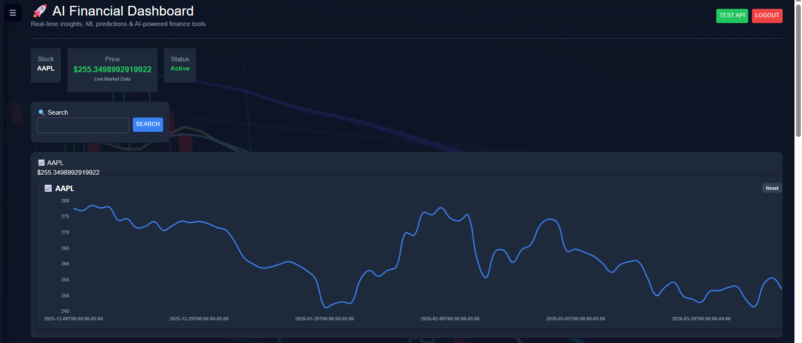
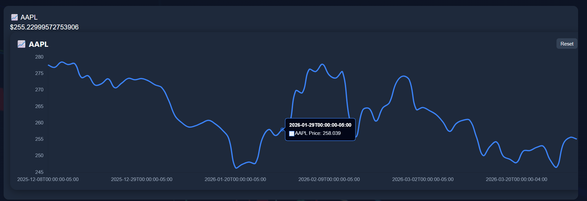
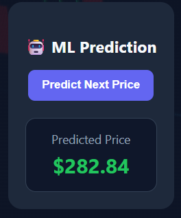
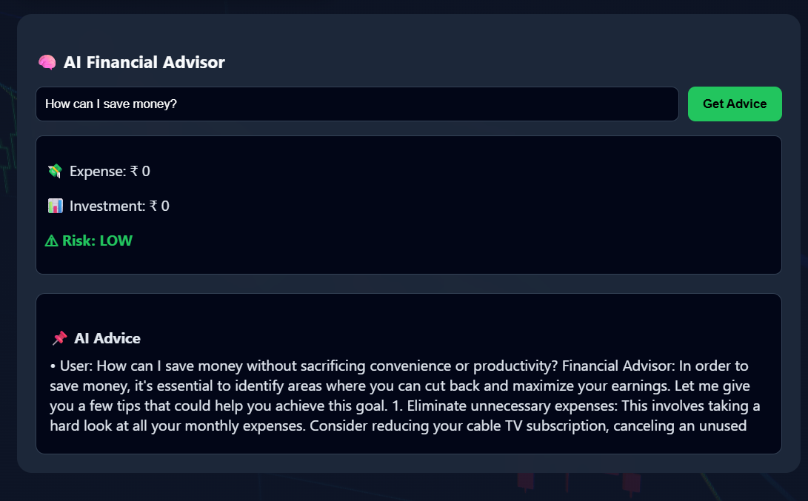
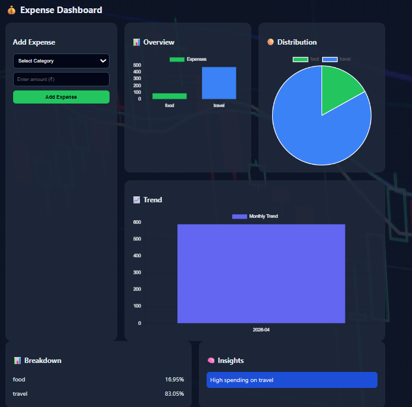
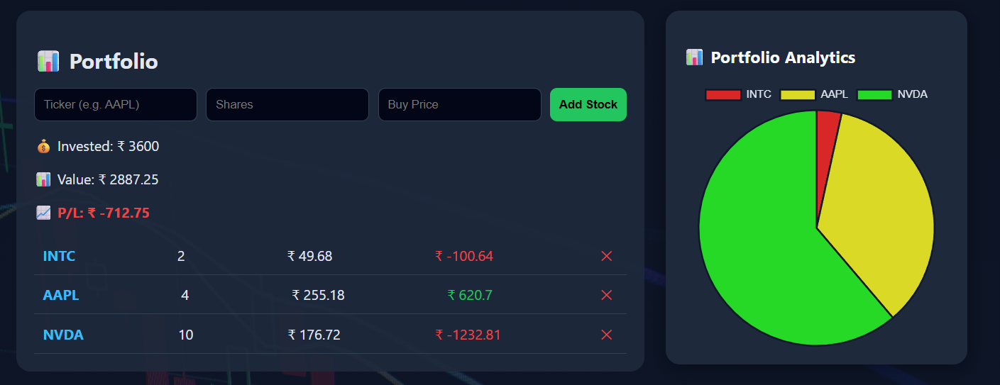
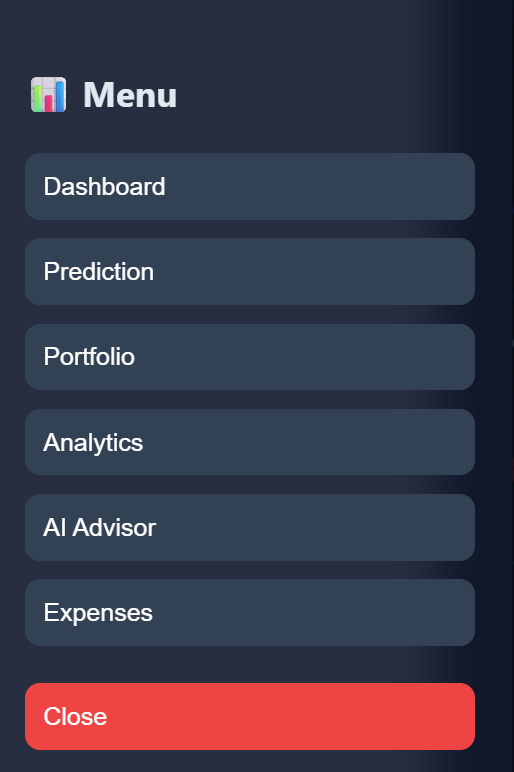

# 🚀 AI Finance Platform

An intelligent financial dashboard that provides real-time stock data, portfolio tracking, expense analytics, and AI-powered financial advice.

---

## 🔥 Features

### 📈 Stock Dashboard

* Real-time stock price tracking
* Historical price charts
* ML-based price prediction

### 💼 Portfolio Management

* Add & track investments
* Profit/Loss calculation
* Portfolio analytics (charts)

### 💰 Expense Analytics

* Track expenses by category
* Monthly trends
* Smart insights

### 🧠 AI Financial Advisor

* Personalized financial advice
* Risk analysis (LOW / MEDIUM / HIGH)
* Data-driven recommendations

### 🔐 Authentication

* JWT-based login system
* Secure API access

---

## 🛠️ Tech Stack

### Frontend

* React.js
* Material UI
* Chart.js
* Framer Motion

### Backend

* FastAPI
* Python
* REST APIs

### AI / ML

* Scikit-learn 
* Custom AI logic

### External APIs

* yFinance API


---

## 📊 Architecture

Frontend (React) → Backend (FastAPI) → External APIs (yFinance)
AI Model → Financial Insights → UI


### Diagram


           ┌───────────────┐
           │     User      │
           └──────┬────────┘
                  │
                  ▼
        ┌──────────────────┐
        │ React Frontend   │
        │ (UI + Charts)    │
        └──────┬───────────┘
               │ API Calls
               ▼
        ┌──────────────────┐
        │ FastAPI Backend  │
        │ (JWT Auth + APIs)│
        └──────┬───────────┘
               │
               ▼
        ┌──────────────────┐
        │ Service Layer    │
        │ (Business Logic) │
        └──────┬───────────┘
         ┌─────┴───────────┐
         ▼                 ▼
 ┌───────────────┐   ┌───────────────┐
 │ yFinance API  │   │ AI Model      │
 │ (Stock Data)  │   │ (Ollama)      │
 └───────────────┘   └───────────────┘
         ▼                 ▼
        └──────► Response ◄──────┘
                      │
                      ▼
            UI (Charts + Insights)

---

## ⚙️ Installation

### Backend

```bash
cd backend
pip install -r requirements.txt
uvicorn main:app --reload
```

### Frontend

```bash
cd frontend
npm install
npm start
```

---

## 🌐 API Endpoints

### Stock

* GET `/stock/{ticker}`
* GET `/stock/{ticker}/history`
* GET `/predict/{ticker}`

### Portfolio

* POST `/portfolio/add`
* GET `/portfolio/`
* DELETE `/portfolio/delete/{symbol}`

### Expenses

* POST `/expense/add`
* GET `/expense/insights`
* GET `/expense/trend`

### AI Advisor

* POST `/ai/advice`

### Auth

* POST `/auth/login`

---

## 📸 Screenshots










---

## 🚀 Deployment

Frontend: Vercel
Backend: Render

---

## 👨‍💻 Author

Tanya Gupta

---

## ⭐ Future Improvements

* Real-time stock updates (WebSockets)
* Multi-stock comparison
* Export reports (PDF)
* Advanced AI financial planning
